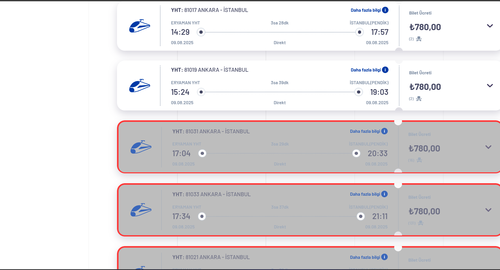

# TCDD E-Bilet Sefer Kontrol

**Puppeteer** kullanarak TCDD E-Bilet üzerinden tren seferlerini kontrol eder.  
Belirlediğiniz kalkış ve varış istasyonları için **ekonomi** ve **business** koltuk sayılarını terminale yazar.  
İsteğe bağlı olarak sürekli tekrar edebilir ve **`q` tuşu ile durdurru**.

---

## Özellikler
- Kalkış ve varış istasyonlarını terminalden parametre olarak verebilirsiniz.
- **Koltuk sayısı bilgilerini** (`EKONOMİ` / `BUSINESS`) gösterir.
- Otomatik tekrar tarama yapar.
- `q` tuşuna basarak durdurabilirsiniz.
- Tarama bitince seferleri vurgulayarak yeni pencerede gösterir.

---

## 📦 Kurulum

```bash
git clone https://github.com/sidarpttr/tcdd-bilet.git
cd tcdd-bilet

#gerekli paketlerin kurulumu
npm install
```

---

## Kullanım

```bash
node tcdd from="ERYAMAN YHT" to="SÖĞÜTLÜÇEŞME" wait=2000 repeat=5
```

**Parametreler:**
- `from` → Kalkış istasyonu (varsayılan: `ERYAMAN YHT`)
- `to` → Varış istasyonu (varsayılan: `SÖĞÜTLÜÇEŞME`)
- `wait` → Her tarama arasındaki bekleme süresi (ms cinsinden) (varsayılan: `2000`)
- `repeat` → Tekrar sayısı (varsayılan: `5`, `inf` girerseniz sınırsız tekrar eder)

---

## Kısayollar
- **`q`** → Botu durdur ve seferleri tarayıcıda göster.

---

## 📝 Örnek Çıktı
```
sayfa yükleniyor...
Kalkış istasyonu seçildi (ERYAMAN YHT)
Varış seçildi ✅ (SÖĞÜTLÜÇEŞME)
Yarın için...
seferler aranıyor...
1. tarama yapılıyor... (almak için 'q')
Tren 81201 -> 4 EKONOMİ ; 0 BUSİNESS
```

```
./assets/image.png
```

```md

```
